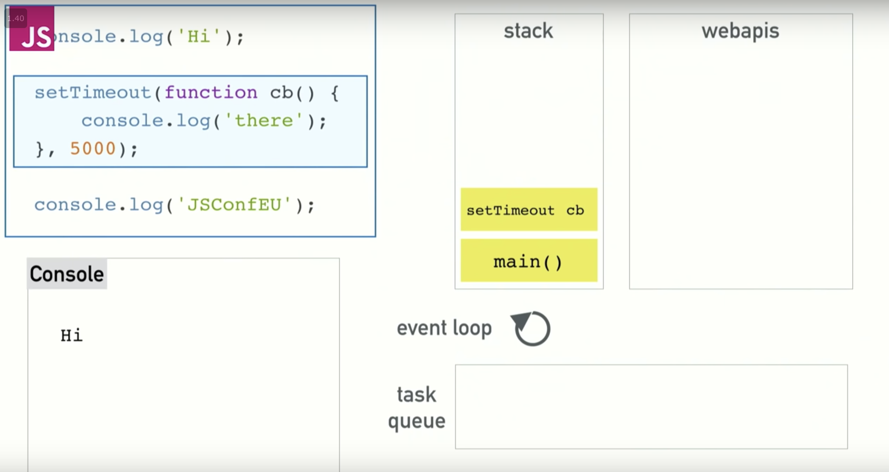

# week 1, day 2
Algorithms, Web, JS, CSS Grid

# Algorithms
---
## Graph Adjacency Matrix

- Adjacency matrix takes up V^2 space, which is very memory intensive for something that is sparse, but very good for something that is dense. 
- for sparse maps., it is better to use an adjacency list instead of a matrix.
- basically impossible for all users in a social network to be friends with every other member, so if FB used an adjacency matrix, would be very intensive on memory.
- if you assume that web pages are nodes, and links are directed edges, web pages would have link to only a few other pages, so graph would be sparse, bad fit for matrix.
- if graph is unweighted, we can represent any Ai, Aj to 0 or 1, 0 as non existent, 1 as existent for the edge
- the matrix will be symmetric, for undirected since each edge goes both ways
  - for directed, it is not symmetric, since an edge from a -> b may not be reciprocated from b->a
- The time complexity:
  - Lookup: O(1) if we have the index of the nodes
    - O(V) + O(1) if we need to find the indices
  - finding adjacent nodes O(v), need to scan the entire list to find connections for that node
  - can store a hash table with names as the key, and index as the value
- Space complexity:
  - Space complexity is O(V^2) which can be very large
  - For large companies, this can be an issue, space complexity can be a problem with billions of nodes

- To represent a weighed graph
  - Aij can represent weight of value
    - we can place any value that may not be used to be a valid edge weight, 0, infinity, etc.
- For sparse graphs matrix is a bad idea since there are so many useless spaces
- Example facebook
  - no way that all nodes(users) are friends with all other nodes
  - if we had 10^9 users(a billion), the number of edges would be 10^18, which would take up 1000PB of memory
    - this is huge
    - if users only had 1000 friends on average, there are only 10^11 edges, but we represnt 10^18 possible
  - 

## Graph Adjacency List
- Can use a list, either linked list, or a binary search tree, which we can keep it balance
  - by keeping it balanced we can insert, search, and deleting in O(logN)
- many ways to store connections in a node
- using a matrix for sparse graphs stores lots of redundant information
- instead of storing all the connections in a matrix, can just store the connection
  - an array for each node, with values in the array representing the connections
  - just one possible representation
  - Can use linked lists, trees, arrays, etc
  - Binary Search tree is probably the best way, keeping it balanced will have O(logV) for insert, delete, search

### Representation of list
can create an array of pointers
- can keep each row as a pointer to an array 
- can create an array of pointers of size 8, where each pointer points to an array of differing sizes.
  - based on how many connections each node has
  - Space complexity would be O(E), compared to O(V^2) for matrix
  - since most real world graphs are sparse, no wasted space memory.
  - Time Cost:
    - Finding if two nodes are connected: O(V) since we know where the node is, could end up searching the entire array. LogV if we use a binary search tree
      - O(1) for matrix
      - Can use a hash object as well to store
      - keeping an array sorted, can be costly
    - Finding all adjacent nodes:
      - O(v) for matrix, and O(v) for list to find all connections as well.
    - if we assume we are dealing with a sparse graph, we know we will never hit O(v).
  - time complexity of search would be O(V) at worst, but can apply a binary search for O(logV)
  - need to keep rows sorted tho, but can amortize the payment, making it at worse O(V) again.

### Example
- if we were to try to find all friends of a user, assuming we have 1000 firends with a billion users, would be 10^9 cells, assuming we can scan 10^6 cells a second, would still take 16 minutes
- while using a list would take 10^4/10^6, assuming 1000 friends, would take 10ms.
- finding if two nodes are connected would take 1/10^6, which is 1microsecond, in a list, it would take 10ms
- is the tradeoff of 16 mins for finding adjacent nodes worth it for the faster lookup?
  - no, users cant wait that long
  - this assumes a sparse graph

### other operations
-  adding new edges
   -  to store a new edge in a matrix can happen at O(1) time
   -  in a list, hard to insert new edges in an array
   -  can use a linked list to make it better, easier to drop and add edges
      -  at worse O(V) for lookup
      -  would be called an adjacency list
      -  could store 3 values, the node, the weight, and pointer to next node
      -  space would still be O(E + V)
      -  Adding a new connection, or delete a new connection, would be O(V) at worse
      -  binary serach tree much better
      -  

# Javascript Closures
- a combination of a function and the lexical enviroment where it was declared
- allow a function to wrap over the variables from the enclosing scope-environment-
- it even has access to the variables after leaving the scope where it was declared
```javascript

function sayHi(name){
  var message = `Hi ${name}!`;
  function greeting() {
    console.log(message)
  }
  return greeting
}
var sayHiToJon = sayHi('Jon');
console.log(sayHiToJon)     // ƒ() { console.log(message) }
console.log(sayHiToJon())   // 'Hi Jon!'
```
- in this code, the greeting function has access to the message outside of its scope, due to closing over it
- will correctly log the argument passed to the function
- The above example covers the two things you need to know about closures:
- Refers to variables in outer scope.
- The returned function access themessage variable from the enclosing scope.
- It can refer to outer scope variables even after the outer function has returned. 
- SayHiToJon is a reference to the greeting function, created when sayHi was run. The greeting function maintains a reference to its outer scope — environment — in which message exists.


- Closures allow for Data Encapsulation, meaning that it protects data that should not be exposed
```javascript
function SpringfieldSchool() {
  let staff = ['Seymour Skinner', 'Edna Krabappel'];
  return {
    getStaff: function() { console.log(staff) },
    addStaff: function(name) { staff.push(name) }
  }
}

let elementary = SpringfieldSchool()
console.log(elementary)        // { getStaff: ƒ, addStaff: ƒ }
console.log(staff)             // ReferenceError: staff is not defined
/* Closure allows access to the staff variable */
elementary.getStaff()          // ["Seymour Skinner", "Edna Krabappel"]
elementary.addStaff('Otto Mann')
elementary.getStaff()          // ["Seymour Skinner", "Edna Krabappel", "Otto Mann"]
```
- in this example, when elementary is created, the outer function is already returned, and staff only existed inside the closure
- gives you access to get staff still, and addStaff, but staff itself is protected.


Ex questions
what is wrong with this code?
```javascript
const arr = [10, 12, 15, 21];
for (var i = 0; i < arr.length; i++) {
  setTimeout(function() {
    console.log(`The value ${arr[i]} is at index: ${i}`);
  }, (i+1) * 1000);
}
```
- since there is a set timeout, the timeout function will not run until everythign else is done
- this means that i=4 at this point, and we will get an error that arr[4] does not exist
- we can fix this by using IIFE(Immediately-invoked function expression) pronounced Iffy
  - coding pattern that allows functions to be called immediately, instead of waiting on the regular javascript
```javascript
const arr = [10, 12, 15, 21];
for (var i = 0; i < arr.length; i++) {
  (function(j) {
    setTimeout(function() {
      console.log(`The value ${arr[j]} is at index: ${j}`);
    }, j * 1000);
  })(i)
}
```
- in this code, we write a for loop, looping over the array, and creating an anonymous function that we call immediately(IFFY immediately-invoked function expression)


# Javascript callstack, concurrency, event loop
- javascript is a single threaded non-blocking asynchronous, concurrent langauge
- has calls tack, event loop, callback queue, and other apis
- JS call stack functions like a regular call stack, LIFO(last in, first out)


- blocking
  - code that is slow, console.log is fast, network requests slow, etc
  - blocking is an issue becuase it locks you out from being able to do anything on the web.
    - big issue, which is why we are given concurrency and event loop

- Asychronous requests
  - code gets stuck, can't do other things until others are done
  - simplest solution is asychronous callbacks
    - run the code later after everything else is done
  - set timeout gets put on the stack, but just disappears, goes to event loop
  

## Concurrency and Event Loop
- Where does the settimeout go after the stack?
- JS lets us do concurrency since browser can do more than just the JS runtime(which can only do 1 thing at a time)
- browser gives us WebAPIs that let us access like threads, and where concurrency happens
- threading is hidden, run somewhere else
- setTimeOut gets called, goes on the stack, then goes to the API call for setTimeOut(External API)

- then browser will set the countdown for you, and since it is done, it will remove itself from the stack.

- now rest of code can be called, (console.log('JSConfEU')) 
- after the asynch call is done(setTimeOut), it will enter the queue(task queue), and wait for the stack to clear until it will be called


## Event Loop
- one job, look at the stack, and the stack queue
- if stack is empty, it will grab the first thing in the queue(first in first out, FIFO)
- now that stack is clear, will move the callbck to the js stack, and in this case, will call the console.log('there'), and put that on the stack as well


### ex. SetTimeOut(0)
- if you want to defer sometime until stack clears, use a time of 0 for setTimeOut, will complete immediately, but dont happen until the normal stack clears.
- setTimeOut isnt gaurantee to run in that time, that is the minimum time it will take to complete.

callback:
- any function that another function calls
- can be an asychnronous callback, that will be pushed onto callback queue in the future.
- by using asych we are able to not block the call stack, otherwise the browser will be 'blocked up' and unable to repaint, or allow user interactions.
- by using asynch we can give the browser a chance to repaint between event loop.

- can also flood the callback queue, only do slow work every few seconds, or until user stops scrolling, not during all user inputs.
- 

# Flashcards
---

## Give a high level overview of an Adjacency Matrix
- an adjacency matrix is a possible represntation of a graph
- it utilizes a 2d array(matrix) where the rows and columns represent the indexed positions of each node in the array
-  corresponding value at Arr[col][row] represents the existence of an edge between those two
-  For an undirected graph, half the positions(V^2 - v) are wasted since it is mirrored over the diagonal
-  dor a directed graph, there is no reducndancy
-  can also represent a weighted graph with values instead of 0/1


## If we were only concerned about time complexity, is an Adjacency Matrix efficient? Why/why not?
- yes, we can look up an edge in O(1) time
- very fast compared to other models
- if we don't have the index of each node, we will have to search through the nodes and it will be O(V)
- Can create a hash object to store the index of each node, that way we dont need to search through the array each time.
- O(1) lookup, deletion, insertion

## If we were only concerned about space complexity, is an Adjacency Matrix efficient? Why/why not?
- It is poor in space complexity, will take up O(V^2), which obviously grows exponentially, with 10^9 users, takes up 10^18 space, which is 1000PB, giant
- can be very pricey depending on the size of the graph
- 

## Give a high level overview of an Adjacency List
- an adjacency list represents only the edges in a graph, but linked to the specific node vs storing all of them in an array or another object
- 


## What benefits do we get from an Adjacency List?
- saves alot of time on space 
- takes longer to lookup things, but finding all adjacent nodes would be much faster than a matrix would


## What are the benefits of a Javascript closure?


## Formally define a Javascript closure


## Give an example of a closure


## What is data encapsulation?
