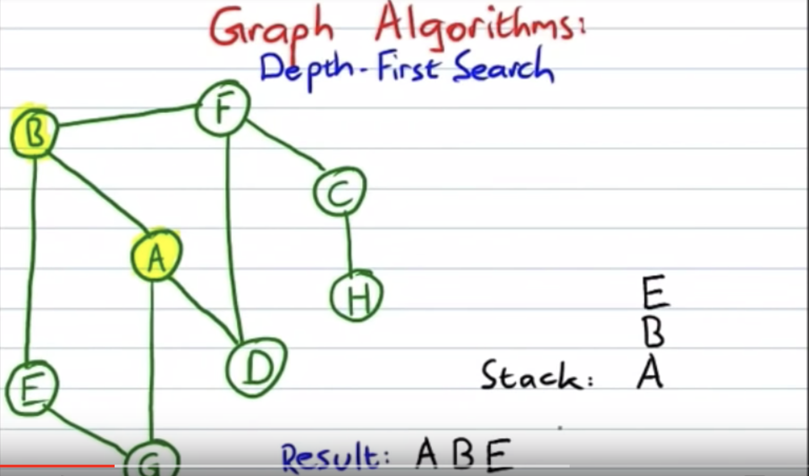
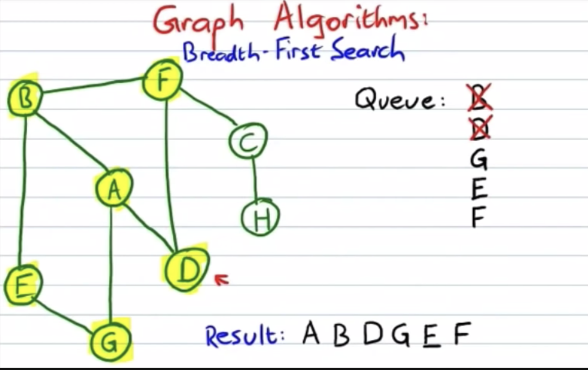

# day 3 notes, DFS

# Algorithms
---
## BFS Graph/DFS Graph explanation

### DFS
- requires a stack
- Starting at the first node, or however you determine where to start, you add that node on the stack, and mark it is visited.
- then you look at its adjacent nodes and visit the lowest/first alphabetically/however you determine to traverse.  
  - you mark that one as visited, then continue this step for this current node
- you continue to visit the lowest node of each node until there are no nodes left to go
- then you go back through the stack, popping them off the stack if there are no new nodes left to visit, and there are no nodes left on the stack, then you are done.

- in this example we would go from A-B-E-G
  - then since G has nowhere to go, we would go back to E, which has nowhere, back to B
  - from B we would go to F
  - from F we go to C, then to H, then back to C, F, and then to D
  - from there we should have visited every node and have finished the traversal
  - our result visit owuld have been:
    - A B E G F C H D

## BFS
- Breadth first search utilizes a queue rather than a stack, meaning it is FIFO, rather last LIFO
- guess is that we will visit:
  - A B D G E F C H
- will start at A, but this time, we stay working on A, instead of moving to the next one
- we will visit them in order by alphabetical order/lowest just like in DFS, except we dont move our current node to the next one, but we do visit them
- when we run out of other vertices/nodes to visit, we will dequeue the first one and make it our current vertex/node

- 

## DFS Search of graphs
- DFS similar to DF traveersal of a tree, except graphs could have cycles
- this means that we need to have a second object/array to indicate which nodes we have visted already.
- 

- in this example, can end up in a cycle between 2-0 and 2-0-1 and 3-3
- we use a visited array so that we dont end up in a loop
- a correct DFS would have us visit 2-0-1-3
- 
```css
// C++ program to print DFS traversal from 
// a given vertex in a  given graph 
#include<iostream> 
#include<list> 
using namespace std; 
  
// Graph class represents a directed graph 
// using adjacency list representation 
class Graph 
{ 
    int V;    // No. of vertices 
  
    // Pointer to an array containing 
    // adjacency lists 
    list<int> *adj; 
  
    // A recursive function used by DFS 
    void DFSUtil(int v, bool visited[]); 
public: 
    Graph(int V);   // Constructor 
  
    // function to add an edge to graph 
    void addEdge(int v, int w); 
  
    // DFS traversal of the vertices 
    // reachable from v 
    void DFS(int v); 
}; 
  
Graph::Graph(int V) 
{ 
    this->V = V; 
    adj = new list<int>[V]; 
} 
  
void Graph::addEdge(int v, int w) 
{ 
    adj[v].push_back(w); // Add w to v’s list. 
} 
  
void Graph::DFSUtil(int v, bool visited[]) 
{ 
    // Mark the current node as visited and 
    // print it 
    visited[v] = true; 
    cout << v << " "; 
  
    // Recur for all the vertices adjacent 
    // to this vertex 
    list<int>::iterator i; 
    for (i = adj[v].begin(); i != adj[v].end(); ++i) 
        if (!visited[*i]) 
            DFSUtil(*i, visited); 
} 
  
// DFS traversal of the vertices reachable from v. 
// It uses recursive DFSUtil() 
void Graph::DFS(int v) 
{ 
    // Mark all the vertices as not visited 
    bool *visited = new bool[V]; 
    for (int i = 0; i < V; i++) 
        visited[i] = false; 
  
    // Call the recursive helper function 
    // to print DFS traversal 
    DFSUtil(v, visited); 
} 
  
int main() 
{ 
    // Create a graph given in the above diagram 
    Graph g(4); 
    g.addEdge(0, 1); 
    g.addEdge(0, 2); 
    g.addEdge(1, 2); 
    g.addEdge(2, 0); 
    g.addEdge(2, 3); 
    g.addEdge(3, 3); 
  
    cout << "Following is Depth First Traversal"
            " (starting from vertex 2) \n"; 
    g.DFS(2); 
  
    return 0; 
} 
```
- this method utilizes a few helpers, first it adds the edges into the graph, then it visits the graph using DFS, and creates a boolean to check whether or not we've visited the nodes yet.
- 

# Web
---
## What happens when you type in www.google.com?
1. Type in Maps.google.com
   
2. Browser checks cache for a DNS record to find corresponding IP address of google.com
- DNS(Domain Name System) is a database that maintains name of websites(URL) and the IP address linked to it
- every URL has a unique IP address, which belongs to the computer that hosts the server of the website that we are visiting.
- for example, google's IP is http://209.85.227.104, which you can visit
   - DNS is like a phonebook for websites, listing URLs and their respective IP addresses
- Browser will check four caches to find the DNS records
  - First, checks browser cache to see if it is in our list of previously visited sites, which our browser stores for a fixed duration
  - Second, browser checks the OS cache, a system call(i.e. gethostname on Windows) to your computer OS, since your computer also has a cache of DNS records
  - third, it checks the router cache, which stores its own records as well
  - Fourth, it checks the ISP(Internet service provider), last one
- not the best in terms of security, but cache's are important to network traffic and improving data transfer time.

3. If the request URL is not in the cache, ISP's DNS server initiates a DNS request to find the IP address of the server that hosts google.com
   - If the URL is not in any of the four caches, ISP's DNS will intiate a DNS query to find the IP address at the server that hosts the site you are trying to go to(maps.google.com)
   - It will search multiple DNS servers on the internet until it finds the correct IP address for the URL(Website).
   - this is a **recursive search** since the search will continue repeatedly from DNS server to DNS server until it either finds the IP Address or returns an error saying it was unable to find it.
   - The ISPs DNS Server will now become the **DNS Recursor** whose job is to find the correct IP Address for the domain by asking other DNS Servers.
   - The other DNS servers would be called **name servers** since they would doing a DNS search based on the website domain name.
  
    - most sites today have a third-level domain, second, and a top level domain.
    - Each of these levels contain their own name servers which is queried during the DNS lookup
    - Ex. maps.google.com
      - First DNS Recursor(searching ISP DNS) will contact the root name server, which will redirect it to the top-level (.com) name server.
      - the top-level name server(.com) will redirect it to the second-level name server (google.com)
      - second-level(google.com) will now find the matching IP for maps.google.com in its DNS records and return it to the DNS Recursor from your ISP, which will send it back to your browser
    - These requests are sent using small data packages 
      - The contain information such as the content of the request, and the IP Address it is destined to(DNS Recursor/ISP DNS Server address)
      - The packets travel through multiple networking equipments before finding the correct DNS Server and going back to your DNS server and eventually your browser
      - They use routing tables to figure out the fastest way for the packet to reach its destination
      - If the packet gets lost, it will send a request failed error.
   
4. browser initiates a TCP connection with the server
   

   1. Client machine sends a SYN packet to the server over the internet asking if it is open for new connections.

2. If the server has open ports that can accept and initiate new connections, it’ll respond with an ACKnowledgment of the SYN packet using a SYN/ACK packet.

3. The client will receive the SYN/ACK packet from the server and will acknowledge it by sending an ACK packet.

Then a TCP connection is established for data transmission!


5. the browser sends an http request to the web server
   
6. server handles the request and sends back a response
   
7. server sounds out an HTTP response
   
8. browser displays the HTML content(for html responses which is the most common)


# flashcards
---

 1. What are the steps for DFS on a graph?
   - using a stack to keep track of your current node, and some data structure(hash object) to keep track of visited nodes
   - starting at the initial node, you check all adjacent nodes
   - select the lowest/first/ however you define it and move to that node, and add it to the stack
   - check all adjacent nodes on that new one
     - if univisted nodes exist, add the lowest to the stack and move there
     - otherwise, remove the current node from the stack and go back to the previous node
   - continue this process until the stack is empty
   - only visit unvisited nodes until the stack is empty
 - BFS
   - Uses a **queue** as the data structure instead of a stack, still have some data structure to keep track of visted nodes, hash object is probably best, O(1) lookup and 
   - this allows us to visit all adjacent nodes before diving deep like in a stack with DFS.
   - You start at the first node, and add all adjacent nodes in order to the queue.
   - after you have visited them all, you dequeue the current node, and move to the next one(should be lowest of the adjacent nodes)
   - continue this until the queue is empty
 2. What supporting data structure might you use for BFS and DFS, respectively?
   - You use a stack for DFS, and queue for BFS.
 3. What happens when you type in www.google.com and hit enter?
   - First your browser will check its cache to see if there is a DNS(Domain Name System) record for the IP Address of the site you went to.
     - DNS allows for human friendly navigation, can go to a website through IP address or URL
     - Browser checks 4 caches:
        1. Browser cache
        2. Operating system cache
        3. router cache
        4. ISP cache
 4. What is the difference between the memory heap and call stack in javascript?
 5. What is one problem with programming languages that are fully single-threaded