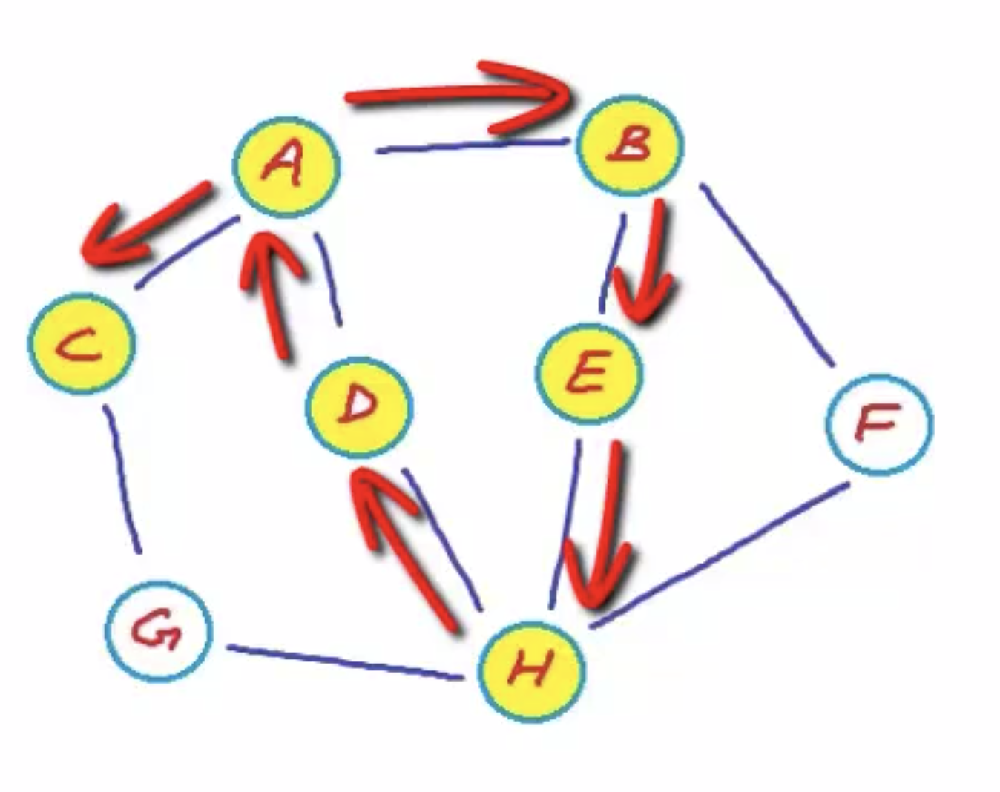
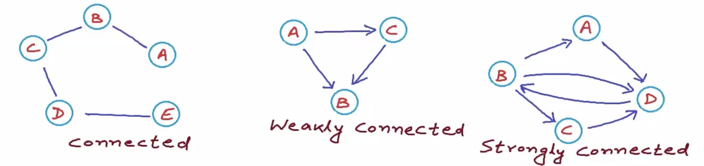
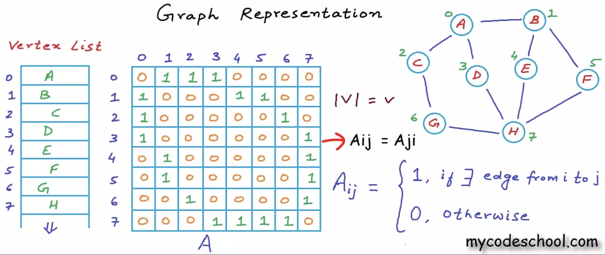

# week 1 day 1, Graphs

## A Gentle intro to graphs
### loosey-goosey graphs


- "A Tree is nothing more than a restricted type of graph with more rules, tree will always be a graph, but not all graphs are trees"
- trees can only flow in one firection, from root node to leaf/child nodes, three can only have a one way connection, child nodes have one parent/root note.
- with **graphs**,nodes can be connected in any way possible, there is not one-directional flow like trees, but can be direct or undirected.
  - can have some with direction and some without


### directionality in graphs

- every graph must have a**t least one node.**
  - considered a **singleton** graph.
- **edges**: (links) connect nodes in any way possible;
  - edges can have directionality/flow, or undirected.
- directed edges:
  - two nodes connected in a specific way, from a -> b, only one way to get from one to another
  - in undirected edges, the travel is bidirectional, can go from a->b->a
- if all edges in a graph are directed it is called a **directed graph(digraph)**


### What are graphs
- Graphs come from math, graph theory
- In math graphs are: a way to formally represent a network, which is a collection of objects that are interconnected.
- We can consider graphs as ordered pairs, where there are vertices(nodes), and edges(connections)
- mathematical definition for a graph is Graph = (V, E), 

- vertices give us each of the nodes in the graph, and the edges give us the directionality or link between these nodes. 

- unlike trees, the nodes in a graph are unordered,
- Vertices and Edges are stored in objects, with each edge stored as its own object with two vertices when unordered.
- in **undirected graphs**, the edges are unordered as well
- in **directed graphs**, the ordering of the edges is important since there is directionality, we must know which one goes first.
 

## Super Social Graphs
- The web is a massive graph structure
- clicking links and urls are going back between different nodes in a graph.
- Some are undirected, can go back and forth between two pages, some only go from one page to another.
- Better example is social networks
- Facebook is an undirected graph, friends go both ways, but snapchat/IG, are directed, users can follow others without being followed back.
  - if users suddenly follow each other, still stays as two seperate edges, since one user could unfollow the other, they are exclusive of each other
-

## intro to graphs video
- edges can connect nodes in any way
- trees are a special type of graph
- graph theory:
  - ordered pairs (a, b)
  - unordered: {a, b}
- web-crawling, browse the web to store data about the web, and search engines store this data to provide accurate results for these queries,
  - basically graph traversal, visiting all nodes in a graph
  -

### Weighted vs Unweighted graphs
- some connections preferable to others
- these edges can have weights that represent friendship level, length, strength, price, etc.
- unweighted graph can be assumed as a weighted graph where all the weights are equal
- undirected graphs can be drawn as directed(bi directional), but directional graphs cannot be converted to undirected. 

# Properties of graphs
- self loop/self edge: edge that points back to the same vertex,(node)
  - can be directed or undirected
  - interlinked webpages can have self loops, going back to the same page
- multi-edge: edge that exists twice in a graph, a->b, a->b
  - can be directed/undirected as well
  - Can reprsent flights between cities, can have multiple flights from city to city
  - can represent different airlines as well, representing flgiht numbers, etc.
- **Simple-Graph**: graph that contains no self-loops or multi-edges.
  - max edges: V(V-1) directed edges, /2 for undirected edges
- Graph is dense of edges ~= vertices, sparse if little edges
- Sparcity will determine what storage structer we will use if it is a very dense( usually an adjacency matrix)
- For sparse graphs, we usually adjacency list.

### Path
- sequence of vertices where each adjacent pair is connected by an edge.< a,b,c,d>
- a path is **simple** if no edge/vertices are repeated
  - also known as a walk
- Trail if vertices are repeated, but not edges
  - Trails are made up of simple paths/walks usually.
  - mutple paths to get to the same vertices


- <A,B,E,H,D,A,C> represents a trail, where from A-C there are two seperate paths, <A,C>, or <A,B,E,H,D,A,C>

### Strength of Graph
- Strengly connected if there is a path from any vertex to and other vertex
- If **undirected** its called **Connected**
- if **directed**, its called **strongly connected**
- if a directed graph has edges between all elements, but each node cant go to every other node, its called weakly connected(if we turn the directional to undirected, it would be connected since there is an edge between each node)


- Intracity streets should be strongly connected, should be able to reach any street from any other street

## Cycle
- walk is a close walk if it starts and ends at the same vertex, length must be greater than 0, minimum 3.
  - cant go from A-> A, A -> B -> A
- cycle refers to a simple cycle, a closed walk where no other vertex or edge is repeated.
- Acyclic graph: graph with no repeating nodes, no cycles in trees
- **Directed Acyclical Graphs(DAG):** graph where there are no cycles and is directed
- cycles cause issues for algorithsm such as shortest path

# Edge List video
- Can store graph in two lists, one for Vertices, one for edges
- Can use a dynamic list
- vertex is identified by its name
- Can store vertex and edges as strings of the name of the vertex
- graph edges can have weight as well, can be stored in the edge object as another attribute/property
  - very slow, slow lookup,

## time complexity, space complexity
- vertex list by name, can assumes names will be reasonable, space will be basically )(|v|), number of nodes
- for edge list, could just pointers/references to the vertex, would be much more efficient, better to have index of the vertex
  - this way space complexity would be O(|E|), instead of taking up 2|v||e|, where each edge would also store two vertices
- time cost here is pretty high

- to find all adjacent nodes, it would be O(|E|), slow, want it to be O(1), constant
- to chedk if given nodes are connected, also O(|E|), have to check all edges
- O(|E|) is much worse than O(|V|) since edges can be the square of |V| 


- have array VxV, where we have the a matrix with each element as a row, and as a column, and 1 representing a edge between the two, and 0 representing no edge

### Adjacency Matrix

- Adjacency matrix takes up V^2 space, which is very memory intensive for something that is sparse, but very good for something that is dense. 
- for sparse maps., it is better to use an adjacency list instead of a matrix.
- basically impossible for all users in a social network to be friends with every other member, so if FB used an adjacency matrix, would be very intensive on memory.
- if you assume that web pages are nodes, and links are directed edges, web pages would have link to only a few other pages, so graph would be sparse, bad fit for matrix.

### Adjacency List
---
- Can use a list, either linked list, or a binary search tree, which we can keep it balance
  - by keeping it balanced we can insert, search, and deleting in O(logN)
- many ways to store connections in a node
- instead of storing all the connections in a matrix, can just store the connection
- can create an array of pointers, 
- can keep each row as a pointer to an array 
- can create an array of pointers of size 8, where each pointer points to an array of differing sizes.
  - based on how many connections we have
  - Space complexity would be O(E)
  - time complexity of search would be O(V) at worst, but can apply a binary search for O(logV)
  - need to keep rows sorted tho, but can amortize the payment, making it at worse O(V) again.
- 
### Questions
1. How do we define graphs, where are they commonly used?

2. What are the specific attributes that graphs can have, and how do we talk about them?

3. What are some ways we might store a graph in memory? What space/time complexity problems might we face?


# RESTful
---
- **RE**presetational **S**tate **T**transfer
- design principles for making network communication more scalable and flexible.
- Answer a few questions:
  - What are the components of the system? 
  - How should they communicate with each other?
  - How do we ensure that we can swap out different parts of the sytem at any time?
  - How can the system be scaled up to serve billions of users?

- Roy T Fielding coined the term in 2000, for his PhD dissertation


# Fielding Constraints
- These constraints are required for a system to be RESTful
## Client Server
  - The network must be made up of servers(source of data) and clients(requester of data)
  - Server is a computer with resource of interest, Client is computer that wants to itneract with the resource stored on the server
  - Client sends HTTP requests to server to access and manipulate information
  - Servers can sometimes act as clients(fetching information from other servers), and sometimes clients can act as servers.
  - NonRESTful alternative would be event-based integration architecture.
    - in this model each component broadcasts events while listening for pertinent information from other components.
    - No one-to-one interactions, only broadcasting and eavesdropping
    - **REST requires one to one communcication.**

## Stateless
  - Stateless means that servers and clients do not have to keep track of each others state
  - When a client is not interacting with server, it has no idea of its existence, only creates connection when necessary, dont need an ongoing link, request-response cycles
  - No record of previous requests either, only standalone requests.


## Uniform Interface
  - Common language between server and client that allows each part to be swapped out or modified without breaking the entire system.
  - Achieved through 4 sub constraints:
    1. Idenfication of resources
    2. manipulation of resources through representation
    3. self descriptive messages
    4. hypermedia
  
### 1. Identification of Resources
- for REST, resource can be anything, HTML document, image, info about a user, weather, etc.
- each resource must be uniquely identified by a stable identifier, meaning it does not change between interactions, and doesn't change when the state of the resource changes.
- Server should give an appropriate response if the request was bad, and give it a link to the new location
- web uses URI to identify resources and HTTP as its communication standard
- When you enter Google.com, your computer makes a GET request to the google servers and if you get a 200 OK response and HTML, your computer will render the response into the webpage so you can view it.
  
### 2. Manipulation of resources through representation
- Client manipulates resources through sending representations(HTTP requests, POST PUT PATCH DELETE, etc) to the server, usually through JSON in an object with the data they would like to add
- like JSON or AJAX
```javascript
{
    method: 'POST',
    url: 'api/likes/',
    data: {
      like: {
        user_id: userId,
        message_id: messageId,
      }
    }
  }  
```
- the user sends HTTP requests to the server, to create, delete, modify, etc
- server takes the request as a suggestion and decides what to do with it
- Vs a GET request, users can modify the page according to their desire, i.e. change the title, picture of a user instead of just getting the users information

### 3. Self-Descriptive Messages
- a message that contains all the information the recipient needs to understand it
- should not be more information in a seperate documentation or in another message.
- example
  - when a user goes to www.google.com the web browser will send a HTTP request like
``` html
GET / HTTP/1.1
Host: www.example.com
```
- this message is self-descriptive, has all the info the server needs to response correctly
- The server will return another self-descriptive response like:
``` html
HTTP/1.1 200 OK
Content-Type: text/html

<!DOCTYPE html>
<html>
  <head>
    <title>Home Page</title>
  </head>
  </body>
    <div>Hello World!</div>
    <a href= “http://www.recurse.com”> Check out the Recurse Center! </a>
    
  </body>
</html>
```
- this response tells the client how to interpret the body, with Content-type: text/html
  
### 4. Hypermedia
- Fancy word for data sent from server to client containing information of what actions the client can do next, what further requests are possible
- in REST, servers should be sending only hypermedia to clients (HTML)
- HTML is a type of hypermedia
- <a href= “http://www.recurse.com”> Check out the Recurse Center! </a> tells the client that it should make a GET request to http://www.recurse.com if the user clicks on the link.
- tells the client to immediately make a GET request to http://www.example.com/awesome-pic.jpg so it can display the image to the user.


- a system has a **uniform interface** if it has an identifier for each resource, manipulates then through sending representations from the client to server, has self-descriptive messages and composed of hypermedia.
- most important aspect of RESTful systems, allows client to intelligently adapt to changes
- 

# Prototype
- Prototypes are a fundamental feature of Javascript. Given this topic's importance to the language, they are a very hot interview/phone screen topic. Having a strong grasp on Javascript Prototypes will give you a major leg-up in the application process.
- We can use __proto__ to determine an objects prototype now, but didn't used to be able to
- JS has prototypal inheritance from the beginning, core feature of JS.
- but before we had to use the "prototype" property of the constructor function.
  
## The prototype property
- new F(), creates a new object, the objects prototype is set to F.prototype;
- if F has a prototype property with value of the object type, new operator sets it to [[Prototype]] for the new object.
- F.prototype means a reguar property names prototype on F.

```javascript
let animal = {
  eats: true
};

function Rabbit(name) {
  this.name = name;
}

Rabbit.prototype = animal;

let rabbit = new Rabbit("White Rabbit"); //  rabbit.__proto__ == animal

alert( rabbit.eats ); // true
```
- in this code, we create this animal object, and set the prototype of the constructor Rabbit to animal, meaning anything created using this constructor will have this prototype of animal.

## Default F.prototype contructor property
- Every function has a prototype by default, the default prototype is an object with the property 'constructor' that points back to the function.
- function Rabbit(){}
- Rabbit.prototype.constructor = Rabbit();
- We can use the constructor property of an object to create a new object of that type.
  - useful for when we have an object and dont know exactly what constructor was used to create it.
- Javascript does not esnure the right "constructor" value
  - if you replace the default prototype, the constructor will be gone all together
  - in order to fix this, we can modify the actualy prototype, instead of rewriting it.
  - Rabbit.prototype.jumps = true
  - or we can replace the prototype and recreate the constructor correctly
```javascript
Rabbit.prototype = {
  jumps: true,
  constructor: Rabbit
};
```

## Summary
- F.prototype is not the same as [[Prototype]], it sets the [[Prototype]] of a new ojbect when new F() is called.
- F.prototype should either be an object or null
- prototype property only has this special effect when it is set to a constructor and invoked using 'new'


# HTML 5
## 10. Accessibility
- Using Semantics and ARIA, create accessible sites is easier now
- new HTML semantic tags
  - <article>
  - <aside>
  - <details>
  - <figcaption>
  - <figure>
  - <footer>
  - <header>
  - <main>
  - <mark>
  - <nav>
  - <section>
  - <summary>
  - <time>
- these allow for users to easily access concent, before was hard to determine what a specific div was, now its easier to examine HTML doc for those who use them
- ARIA is a W3C(World Wide Web Consortium) spec that is used to assign specific 'roles' to elements in an html doc
  - creating important landmarks on the page, header, footer, nav, article, using role attributes
  - HTML5 validates these attributes, and will have built in roles that can't be overwritten.

## 9. Video and Audio support
- Support for HTML5 <video> and <audio> tags, don't need to use flash player anymore.
- used to have to use <embed> and <object> tags to assign parameters to get videos to work properly
- now we can use inline styling to get video sizing<video src=”url” width=”640px” height=”380px” autoplay/>
- nowadays everyone is using HTML5, so don't need to embed, but might have to check every browser for its 

## 8. Doctype
- Can Easily decalre doctype now, don't need long lines of head tags with doctype attributes


## 7. Cleaner Code
- allows you to write cleaner, more descriptive, semantic code to seperate meaning fro style and content
- no more divs on divs on divs, and classitis, HTML headers and semantic tags fix this issue.
```html
<div id="header">
 <h1>Header Text</h1>
 <div id="nav">
  <ul>
   <li><a href="#">Link</a></li>
   <li><a href="#">Link</a></li>
   <li><a href="#">Link</a></li>
  </ul>
 </div>
</div>
```
vs. 
```html
<header>
 <h1>Header Text</h1>
 <nav>
  <ul>
   <li><a href="#">Link</a></li>
   <li><a href="#">Link</a></li>
   <li><a href="#">Link</a></li>
  </ul>
 </nav>
</header>
```

## 6. Smarter Storage
- Local storage allows a mix of old cookies and client side database. 
- allows for storage across multiple windows, has better security, and data persists after a browser is closed
- is essentially client side db, dont have to worry about user deleting cookings and is adopted by all popular browsers
- local storage allows for web apps that don't require third party plugins.
- allows you to store user info, cache data, and load previous stat.

## 5. Better Interactions
- allows for better interactions and dynamic websites.
- users can interact with a <canvas> that allows them to interact with, and for you to animate
- html5 also comes with new APIs that allow you to build better UX such as
  - drag and drop
  - offline storage db
  - browser history management
  - document editing
  - timed media playback

## 4. Game Development
- Can develop games using <canvas>. HTML provides mobile friendly way to develop fun interactive games

## 3. Legacy/Cross Browser Support
- HTML5 was developed so that all browsers can use it.
- even if a browser doens't like it, we can add a JS script that will convert it back.
- 

## 2. Mobile, Mobile, Mobile
- HTMl5 replaced mobile flash, is very mobile friendly
- mobile browsers fully adopted html5, and allow for easy responsive, mobile first design.
- great meta tags for mobile:
  - Viewports: allow you to define viewport widht and zoom setting
  - Full screen browsing: ios specific values that allow apple devices to display in full screen mode
  - home screen icons: like favicon on desktop, icons are used to add favirotes to the home screen of an ios and android device

## 1. Its the future(now?)
- use it


# flashcards
---
 ### How do we define a graph mathematically?
 - a way to formally represent a network, which is a collection of objects that are interconnected.
 - G = (V, E), where V = vertices/nodes, and E = Edges, links
 - 


 ### What is the difference between directed, undirected, weighted, and unweighted?
 - directed graphs have edges where order matters, can only traverse in one direction
 - undirected graphs are bidirectional, can go back and forth between nodes
 - weighted edges represent some attribute between two nodes, time, length, strength, etc.
 - unweighted edges represent a graph where all edges are equal in precedence.
 - 


 ## Give an example of various types of graphs (Weighted Undirected, Unweighted Directed, Unweighted Undirected, etc.)
 - Weighted Undirected: Friendships in facebook, where weight could represent how often users chat/post/interact with each other
  - can also represent freeways between cities where the weight is the distance/time to travel, and the nodes represent cities.

 - Weighted Directed: Can represent Instagram users where the weight is how often the first user interacts with the second, and the direction is from user1 to user2
  - can also represent a streets in a city where weight is the distance/time of travel, and direction represents whether or not the streets are one way or bi-directional

 - Unweighted Undirected: Social network like facebook where users can have friend with equal weight, and friendships go both ways.


 - Unweighted Directed: The world wide web is an unweight directed graph, where links bring you from node to node, and may not always have return edges.  Links have no precedence?(maybe with ads and sponsors, they could have a higher weight on a users search or something)

 ### What makes a graph a simple graph? What attributes would make it not simple?
 - have no self edges or multi edges


 ### What is the maximum number of edges in a directed simple graph? Undirected simple graph? Answer should be in terms of N
- directed: N(N-1), N = number of nodes
- undirected: (N(N-1))/2, half the number of directed edges


 ### Describe the levels of connectivity a graph can have (strongly connected, weakly connected).
 - Connected graphs are undirected graphs that have connections from each element to another 


 ### What are cycles?
 - cycles are paths in a graph that repeat a node, meaning that you can go from a node back to itself.
 - there are simple cycles, closed cycles, etc.


 ### What are some naive ways we can store and traverse graphs? Be able to discuss time/space complexity of these approaches, and what issues we may face.
- we can store graphs in arrays, with edges in a array as well, where each element would represent an edge in either an object(undirected), or 


 ### What are the three primary Fielding constraints? (Bonus if you can say who Fielding is!)
 -Roy T Fielding is a PhD in CS who wrote a dissertation on web systems and coined the term RESTful (REpresentational State Transfer). 
 - the three primary Fielding Constraints are:
    1. Client Server relationship, where clients send HTTP requests to servers on a one time basis, no ongoing or eavesdropping, broadcasting relationship
    2. Stateless, server/clients do not keep track of each others state, when not interacting, they have no idea of each others existence
    3. Uniform interface, systems must keep consistent methods of communication between client and server, common language


 ### What sub-constraints make up a Uniform Interface
  - Idenfication of Resources, consistent naming and using stable identifiers that do not change so that requets to the same URI get the same response regardless of time
  - manipulation of resources through representation, the client is able to modify the resource through sending representations to the server via JSON or something similar, including information that they would like to add, delete, modify.
    - User sends PUT, PATCH, DELETE, requests and server decides what to do, this modifies the actualy response and html
  - self descriptive messages, messages include all relevant information and come in a single response/request.
  - hypermedia, serversshould only send hypermedia to clients, meaning 


 ### Walk through an arbitrary example of a RESTful request/response cycle, and describe what makes it RESTful


 ### Give a high level overview of what an object's prototype represents
 - an objects prototype represents the inheritance(methods, properties) that the objects receives from its parent class
 - the __proto__ of an object is inherited from the prototype property of the constructor it was created from.
 
 ### What are the differences between the __proto__ and prototype attributes?
 - F.prototype is just a regular property named prototype, while __proto__ is actually the [[Prototype]]
 - if we set the prototype of a constructor to an object, it will automatically set the [[Prototype]] of any object created from it to that object.
 - Prototype is the inheritance of an object, while prototype is just a regular named property called prototype
 - 
 
 ### What happens when we do or don't explicity set an object's prototype?
 - if we don't set an objects protottype it will get a default prototype 
 
 ### What is an object's default prototype?
 - an objects default prototype is an object with the constructor function that created it.
 
 
 ### What are the valid values for an object's prototype?
 - either an object, or null
 
 ### Name 5 benefits of HTML5
 
 
 ### What is localStorage? How might you use it?
 
 
 ### Why are media queries useful?
 
 
 ### What is mobile-first design? Be as specific as possible.