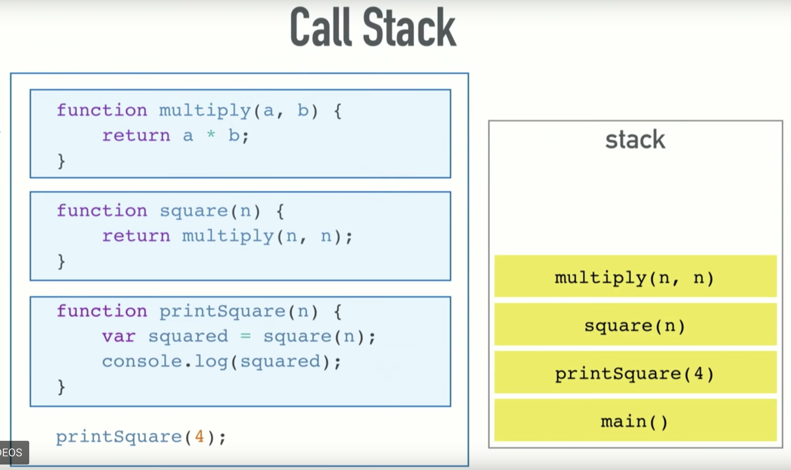
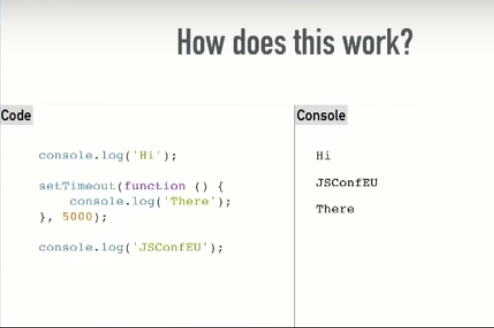
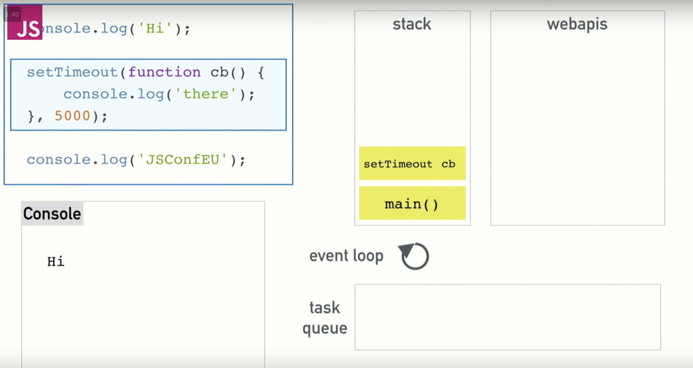
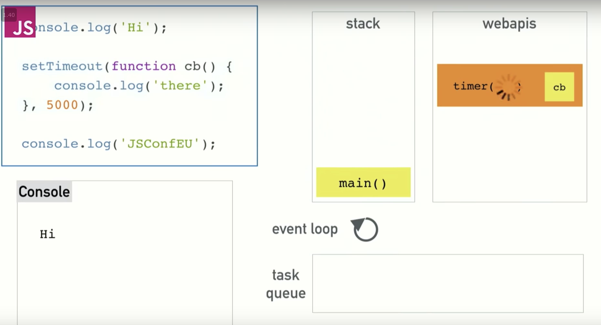
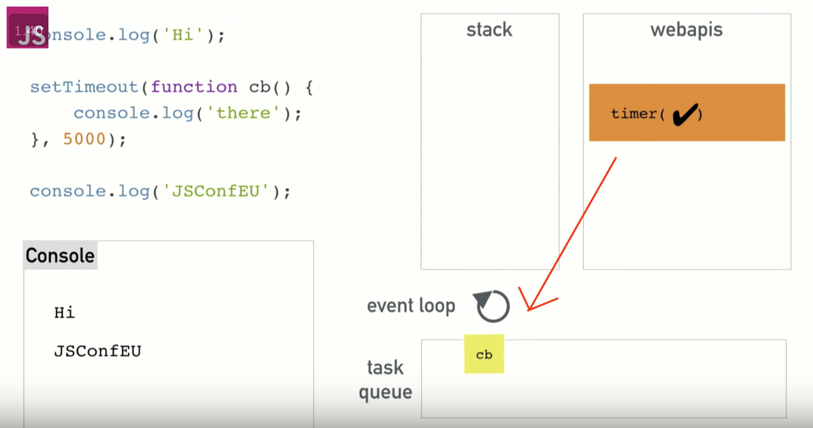
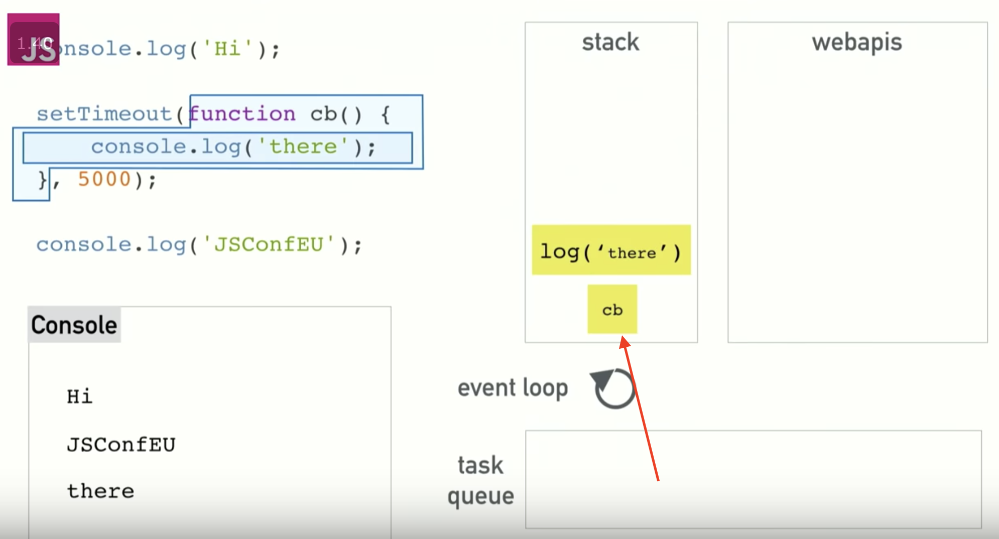

# Notes

# Javascript callstack, concurrency, event loop
- javascript is a single threaded non-blocking asynchronous, concurrent langauge
- has calls tack, event loop, callback queue, and other apis
- JS call stack functions like a regular call stack, LIFO(last in, first out)

- blocking
  - code that is slow, console.log is fast, network requests slow, etc
  - blocking is an issue becuase it locks you out from being able to do anything on the web.
    - big issue, which is why we are given concurrency and event loop

- Asychronous requests
  - code gets stuck, can't do other things until others are done
  - simplest solution is asychronous callbacks
    - run the code later after everything else is done
  - set timeout gets put on the stack, but just disappears, goes to event loop
  

## Concurrency and Event Loop
- Where does the settimeout go after the stack?
- JS lets us do concurrency since browser can do more than just the JS runtime(which can only do 1 thing at a time)
- browser gives us WebAPIs that let us access like threads, and where concurrency happens
- threading is hidden, run somewhere else
- setTimeOut gets called, goes on the stack, then goes to the API call for setTimeOut(External API)

- then browser will set the countdown for you, and since it is done, it will remove itself from the stack.

- now rest of code can be called, (console.log('JSConfEU')) 
- after the asynch call is done(setTimeOut), it will enter the queue(task queue), and wait for the stack to clear until it will be called

## Event Loop
- one job, look at the stack, and the stack queue
- if stack is empty, it will grab the first thing in the queue(first in first out, FIFO)
- now that stack is clear, will move the callbck to the js stack, and in this case, will call the console.log('there'), and put that on the stack as well

### ex. SetTimeOut(0)
- if you want to defer sometime until stack clears, use a time of 0 for setTimeOut, will complete immediately, but dont happen until the normal stack clears.
- setTimeOut isnt gaurantee to run in that time, that is the minimum time it will take to complete.

callback:
- any function that another function calls
- can be an asychnronous callback, that will be pushed onto callback queue in the future.
- by using asych we are able to not block the call stack, otherwise the browser will be 'blocked up' and unable to repaint, or allow user interactions.
- by using asynch we can give the browser a chance to repaint between event loop.

- can also flood the callback queue, only do slow work every few seconds, or until user stops scrolling, not during all user inputs.

